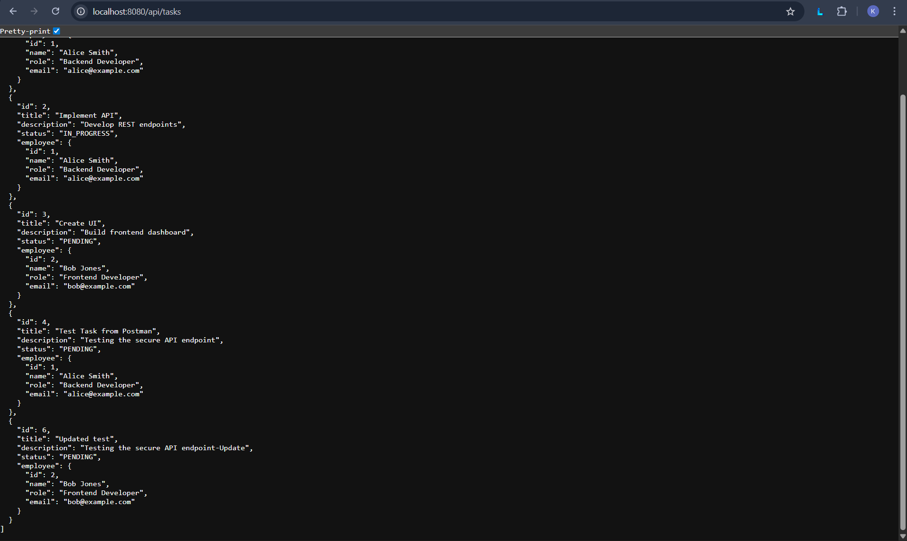
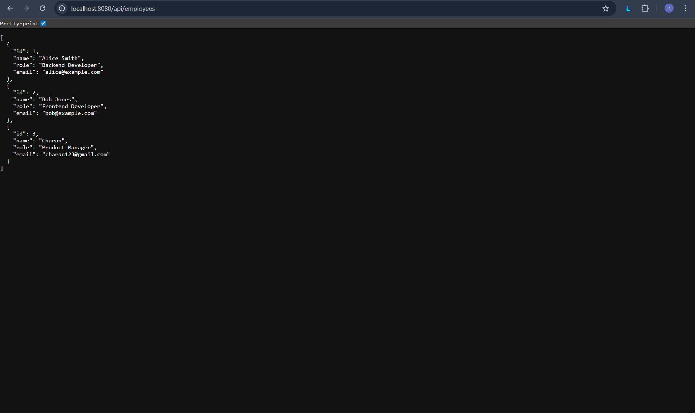

# Task Management API

This is a RESTful API for managing Employees and Tasks, built with Java and Spring Boot.

## Tech Stack
- **Java 17**
- **Spring Boot 3.2.3**
- **Spring Data JPA**
- **H2 Database** (In-memory database for development/testing)
- **Lombok**
- **Maven**

## Setup and Run Instructions

1.  **Clone the repository:**
    ```bash
    git clone <repository-url>
    cd taskmanager
    ```

2.  **Build the project:**
    ```bash
    ./mvnw clean install
    ```
    (If `mvnw` is not present, use `mvn clean install` if you have Maven installed globally)

3.  **Run the application:**
    ```bash
    ./mvnw spring-boot:run
    ```
    Or run the `TaskManagerApplication.java` class from your IDE.

4.  **Access the API:**
    The API runs on `http://localhost:8080`.

5.  **H2 Console:**
    Access the database console at `http://localhost:8080/h2-console`.
    - **JDBC URL:** `jdbc:h2:mem:taskdb`
    - **User:** `sa`
    - **Password:** `password`

## Authentication (Bonus Challenge)
The API is secured using a simple API Key mechanism.

- **Public Endpoints:**
    - `GET /api/tasks`
    - `GET /api/employees`
    - `/` (Home)
- **Protected Endpoints:**
    - `POST`, `PUT`, `DELETE` operations require authentication.

**How to Authenticate:**
Add the header `X-API-KEY` with the value `prou-backend-secret-key` to your requests.

Example:
```bash
curl -X POST http://localhost:8080/api/tasks \
  -H "Content-Type: application/json" \
  -H "X-API-KEY: prou-backend-secret-key" \
  -d '{"title": "Secure Task", "status": "PENDING"}'
```

## API Endpoints

### Employees

| Method | Endpoint | Description | Request Body |
|---|---|---|---|
| GET | `/api/employees` | List all employees | - |
| GET | `/api/employees/{id}` | Get employee by ID | - |
| POST | `/api/employees` | Create a new employee | `{ "name": "John Doe", "role": "Developer", "email": "john@example.com" }` |

### Tasks

| Method | Endpoint | Description | Request Body |
|---|---|---|---|
| GET | `/api/tasks` | List all tasks (Optional filters: `?status=PENDING`, `?employeeId=1`) | - |
| GET | `/api/tasks/{id}` | Get task by ID | - |
| POST | `/api/tasks` | Create a new task | `{ "title": "Fix Bug", "description": "Fix login bug", "status": "PENDING" }` |
| PUT | `/api/tasks/{id}` | Update a task | `{ "title": "Fix Bug Updated", "description": "...", "status": "IN_PROGRESS" }` |
| DELETE | `/api/tasks/{id}` | Delete a task | - |
| PUT | `/api/tasks/{id}/assign/{employeeId}` | Assign task to employee | - |

## Assumptions
- An in-memory H2 database is used for simplicity. Data will be lost on restart.
- "Status" is an Enum: `PENDING`, `IN_PROGRESS`, `COMPLETED`.

## Sample Data
The application can be pre-loaded with data using `src/main/resources/data.sql`.
A reference database schema is provided in `src/main/resources/schema.sql`.

## Screenshots






